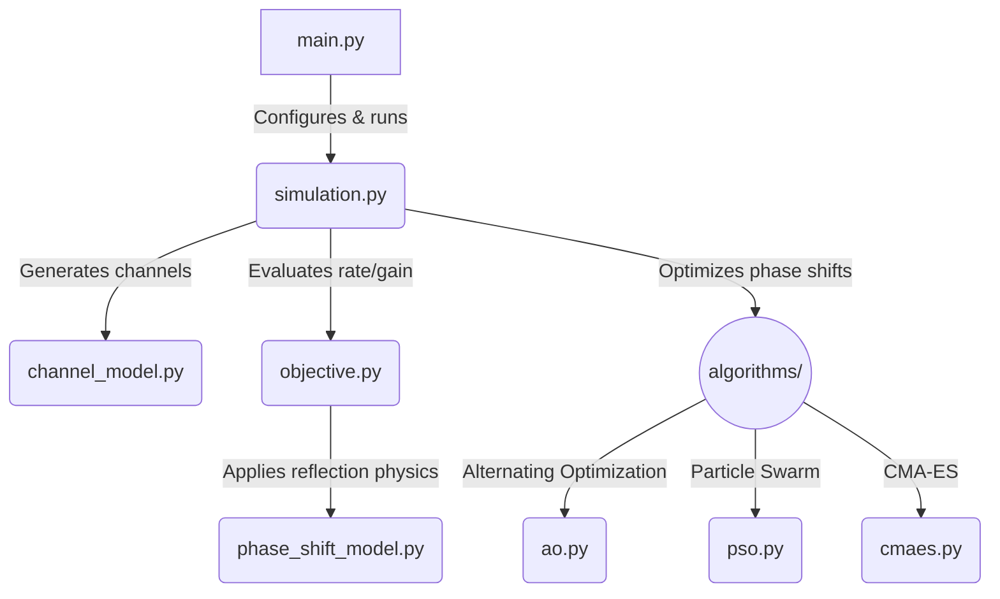

<div align="center">
  <h1>IRS Phase Shift Optimization</h1>
  <p><strong>Maximizing Spectrum Efficiency in Intelligent Reflecting Surface-Aided Wireless Networks</strong></p>
  <p>
    <a href="./PhaseShift_Model.pdf">📄 Read the Reference Paper</a> |
    <a href="./PSO_Report.pdf">📄 Read the PSO Report</a>
  </p>
</div>

<br />

## Introduction

Intelligent Reflecting Surfaces (IRS) have emerged as a disruptive technology capable of smartly reconfiguring the wireless propagation environment. By intelligently tuning the phase shifts of massive numbers of low-cost passive reflecting elements, an IRS can significantly enhance signal quality at the receiver.

This repository provides a comprehensive simulation framework to optimize the **achievable rate (spectrum efficiency)** of an IRS-aided wireless communication system. It features a deep comparative analysis between **ideal** reflection models and **practical** reflection models (where the reflection amplitude is fundamentally coupled with the phase shift).

## Reference Paper

The models and optimization schemes in this repository are inspired by state-of-the-art literature on practical IRS phase shift modeling. The codebase is designed to reproduce the findings that ignoring the amplitude-phase coupling in IRS elements leads to sub-optimal designs, and that specialized algorithms are required to unlock the true potential of practical IRS hardware.

## The Approach

Optimizing the phase shifts of an IRS is a highly non-convex problem. To tackle this, we implement and benchmark three distinct algorithmic approaches:

1. **Alternating Optimization (AO) [Baseline]**
   A rigorous coordinate-descent approach for CPU execution.
2. **Particle Swarm Optimization (PSO)**
   A meta-heuristic algorithm utilizing multi-strategy initialization, ring topologies, and constriction factors for robust multi-modal search space exploration.
3. **Covariance Matrix Adaptation Evolution Strategy (CMA-ES)**
   An advanced evolutionary strategy that adaptively updates its search distribution to find the global optimum.

## Achieved Results

### Comparisons with Reference Paper

This simulation framework successfully reproduces the key findings from the original literature:

- **Rate vs. Distance (Fig. 5):** The generated curves accurately reflect the paper's results, showing that the practical phase shift model introduces a noticeable performance gap compared to the ideal model. This gap is most prominent when the user is located at intermediate distances where the reflected path dominates.
- **Scaling with N (Fig. 6):** The simulation confirms the theoretical power gain scaling when using continuous phase shifts, while also accurately depicting the scaling penalties induced by the amplitude-phase coupling in practical scenarios.
- **Discrete Phase Shifts (Fig. 7):** As established in the literature, the results confirm that using 2-bit or 3-bit discrete phase shifts achieves performance that is nearly identical to the continuous phase shift case, serving as a highly cost-effective design choice for practical IRS deployments.

### Simulation Figures

Here are the simulation results demonstrating the performance of the various algorithms under different system parameters:

### 1. Achievable Rate vs. AP-User Distance

Demonstrates how the system performs as the distance between the Access Point and the user increases.
<p align="center">
  
</p>

#### Detailed Result Table (Fig. 5)

| Scheme | 480 | 482 | 484 | 486 | 488 | 490 | 492 | 494 | 496 | 498 | 500 |
|:---| ---: | ---: | ---: | ---: | ---: | ---: | ---: | ---: | ---: | ---: | ---: |
| upper_bound | 0.3464 | 0.3690 | 0.4071 | 0.4596 | 0.5501 | 0.6777 | 0.9020 | 1.2981 | 2.0564 | 3.4159 | 4.6232 |
| ao_practical_prop1 | 0.2725 | 0.2823 | 0.3016 | 0.3291 | 0.3770 | 0.4444 | 0.5713 | 0.8044 | 1.3157 | 2.4194 | 3.5354 |
| ao_practical_1d | 0.2725 | 0.2823 | 0.3016 | 0.3291 | 0.3771 | 0.4444 | 0.5712 | 0.8046 | 1.3162 | 2.4210 | 3.5340 |
| ideal_design_practical_eval | 0.2589 | 0.2663 | 0.2821 | 0.3043 | 0.3444 | 0.3989 | 0.5033 | 0.6926 | 1.1205 | 2.0680 | 3.0390 |
| lower_bound | 0.1747 | 0.1683 | 0.1664 | 0.1610 | 0.1618 | 0.1576 | 0.1584 | 0.1565 | 0.1556 | 0.1540 | 0.1501 |
| pso_practical | 0.2717 | 0.2813 | 0.3003 | 0.3274 | 0.3748 | 0.4410 | 0.5656 | 0.7937 | 1.2950 | 2.3725 | 3.4643 |
| cmaes_practical | 0.2723 | 0.2820 | 0.3012 | 0.3285 | 0.3763 | 0.4433 | 0.5694 | 0.8006 | 1.3091 | 2.4000 | 3.5007 |

### 2. Achievable Rate vs. Number of Reflecting Elements (N)

Illustrates the scaling behavior of the achievable rate as more IRS elements are added.
<p align="center">
  
</p>

#### Detailed Result Table (Fig. 6)

| Scheme | 10 | 20 | 30 | 40 | 50 | 60 | 70 | 80 |
|:---| ---: | ---: | ---: | ---: | ---: | ---: | ---: | ---: |
| upper_bound | 1.0496 | 1.9901 | 2.7857 | 3.4050 | 3.9433 | 4.4015 | 4.7774 | 5.1355 |
| ao_practical_prop1 | 0.6718 | 1.3046 | 1.9039 | 2.4091 | 2.8728 | 3.2787 | 3.6207 | 3.9507 |
| ao_practical_1d | 0.6719 | 1.3049 | 1.9043 | 2.4093 | 2.8743 | 3.2769 | 3.6190 | 3.9555 |
| ideal_design_practical_eval | 0.5669 | 1.0902 | 1.5944 | 2.0568 | 2.4811 | 2.8479 | 3.1870 | 3.4979 |
| lower_bound | 0.1490 | 0.1575 | 0.1550 | 0.1478 | 0.1522 | 0.1476 | 0.1506 | 0.1463 |
| pso_practical | 0.6723 | 1.3039 | 1.8887 | 2.3639 | 2.7852 | 3.1478 | 3.4525 | 3.7544 |
| cmaes_practical | 0.6722 | 1.3035 | 1.8943 | 2.3909 | 2.8375 | 3.2252 | 3.5506 | 3.8743 |

### 3. Impact of Discrete Phase Shifts

Evaluates the performance degradation when the IRS is constrained to low-resolution discrete phase shifts (e.g., 1-bit, 2-bit, or 3-bit).
<p align="center">
  
</p>

#### Detailed Result Table (Fig. 7)

| Scheme | 400 | 420 | 440 | 460 | 480 | 498 |
|:---| ---: | ---: | ---: | ---: | ---: | ---: |
| upper_bound | 0.3346 | 0.2933 | 0.2609 | 0.2593 | 0.3426 | 3.4098 |
| lower_bound | 0.3155 | 0.2682 | 0.2255 | 0.1979 | 0.1723 | 0.1501 |
| ao_practical_discrete_1 | 0.3227 | 0.2775 | 0.2386 | 0.2202 | 0.2314 | 1.6933 |
| ao_ideal_discrete_1 | 0.3276 | 0.2841 | 0.2480 | 0.2364 | 0.2764 | 2.5308 |
| ao_practical_discrete_2 | 0.3252 | 0.2809 | 0.2433 | 0.2283 | 0.2533 | 2.0826 |
| ao_ideal_discrete_2 | 0.3316 | 0.2893 | 0.2551 | 0.2491 | 0.3123 | 2.9904 |
| ao_practical_discrete_3 | 0.3265 | 0.2826 | 0.2457 | 0.2324 | 0.2650 | 2.3095 |
| ao_ideal_discrete_3 | 0.3321 | 0.2900 | 0.2561 | 0.2509 | 0.3172 | 3.0392 |

## Codebase Analysis & Architecture



The repository is structured as follows to ensure modularity and scalability:

```text
.
├── config.py                     # System parameters and optimizer settings
├── main.py                       # CLI entry point for simulation figures
├── simulation.py                 # Experiment orchestration
├── plot_results.py               # Simulation plotting functions
├── channel_model.py              # Wireless channel generation
├── objective.py                  # Achievable-rate objective functions
├── phase_shift_model.py          # Practical IRS reflection model
├── algorithms/
│   ├── ao.py                     # Alternating Optimization baseline
│   ├── pso.py                    # Particle Swarm Optimization
│   ├── cmaes.py                  # CMA-ES
│   └── polishing.py              # Local solution refinement
├── assets/                       # Published README/report figures
├── PSO_Report.pdf                # Compiled PSO report
└── PhaseShift_Model.pdf          # Reference paper
```

## How to Apply (Usage Guide)

### Prerequisites

Ensure you have Python 3.10 or newer installed. Clone this repository and install the dependencies:

```bash
git clone https://github.com/tuankhai1/IRS-PHASE-SHIFT-OPTIMIZATION.git
cd IRS-PHASE-SHIFT-OPTIMIZATION
python -m pip install -r requirements.txt
```

### Running the Simulations

To run the full suite of simulations (1000 channel realizations per scenario):

```bash
python main.py
```

To run a rapid test cycle (useful for verifying dependencies, runs only 20 realizations):

```bash
python main.py --quick
```

To run a specific simulation figure independently:

```bash
python main.py --fig 5  # Fig. 5: Rate vs. Distance
python main.py --fig 6  # Fig. 6: Rate vs. N
python main.py --fig 7  # Fig. 7: Discrete phase shifts
```

### Outputs

All simulation results are automatically serialized as `.npz` files and plotted as `.png` files inside the `results/` directory.

---
*Created for the advancement of Intelligent Reflecting Surface research.*
