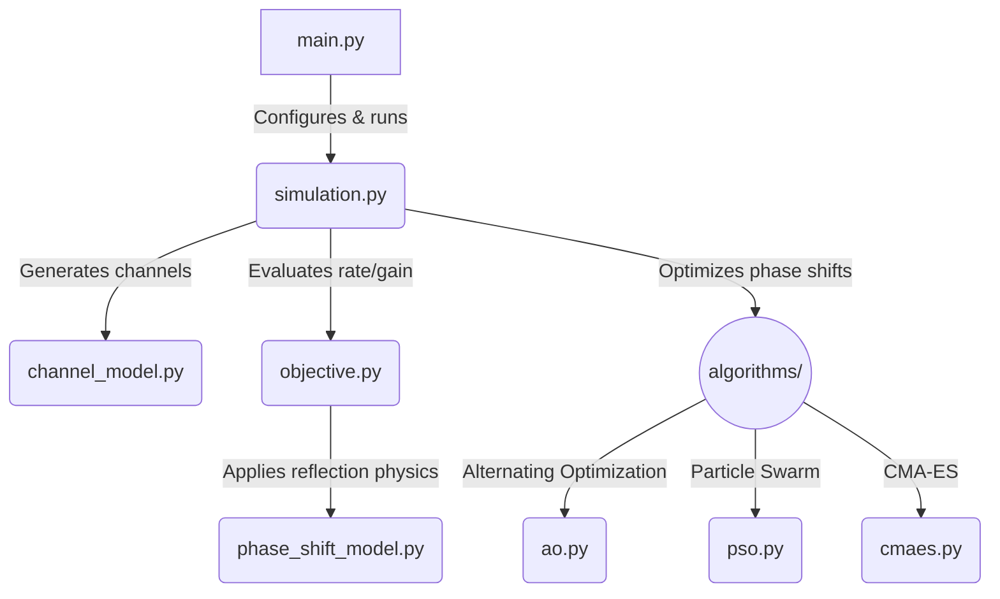

<div align="center">
  <h1>IRS Phase Shift Optimization</h1>
  <p><strong>Maximizing Spectrum Efficiency in Intelligent Reflecting Surface-Aided Wireless Networks</strong></p>
  <p>
    <a href="./PhaseShift_Model.pdf">📄 Read the Reference Paper</a> |
    <a href="./PSO_Report.pdf">📄 Read the PSO Report</a>
  </p>
</div>

<br />

## Introduction

Intelligent Reflecting Surfaces (IRS) have emerged as a disruptive technology capable of smartly reconfiguring the wireless propagation environment. By intelligently tuning the phase shifts of massive numbers of low-cost passive reflecting elements, an IRS can significantly enhance signal quality at the receiver.

This repository provides a comprehensive simulation framework to optimize the **achievable rate (spectrum efficiency)** of an IRS-aided wireless communication system. It features a deep comparative analysis between **ideal** reflection models and **practical** reflection models (where the reflection amplitude is fundamentally coupled with the phase shift).

## Reference Paper

The models and optimization schemes in this repository are inspired by state-of-the-art literature on practical IRS phase shift modeling. The codebase is designed to reproduce the findings that ignoring the amplitude-phase coupling in IRS elements leads to sub-optimal designs, and that specialized algorithms are required to unlock the true potential of practical IRS hardware.

## The Approach

Optimizing the phase shifts of an IRS is a highly non-convex problem. The default simulation pipeline follows the reference paper's AO-based schemes:

1. **Alternating Optimization (AO) [Baseline]**
   A rigorous coordinate-descent approach for CPU execution.
2. **Ideal-model design with practical evaluation**
   A paper baseline showing the loss caused by ignoring amplitude-phase coupling during design.
3. **No-IRS lower bound and discrete phase-shift variants**
   Baselines used to reproduce the paper's continuous and discrete phase-shift figures.

The continuous-phase figures also include default and improved PSO/CMA-ES variants for comparison against AO under the same channel realizations and practical phase-shift objective.

## Current Pipeline

The simulation pipeline keeps the paper settings fixed and adds PSO/CMA-ES only as comparison optimizers. The paper-aligned schemes are:

- `upper_bound`: ideal phase-shift model.
- `ao_practical_prop1`: AO with the practical model and Proposition 1.
- `ao_practical_1d`: AO with the practical model and 1D search.
- `ideal_design_practical_eval`: ideal-model design evaluated with the practical model.
- `lower_bound`: no IRS.

For Fig. 5 and Fig. 6, the following additional optimizers are run under the same channel realizations and practical phase-shift objective:

- `pso_default`: standard global-best PSO baseline.
- `cmaes_default`: standard single-start CMA-ES baseline.
- `pso_practical`: improved PSO variant.
- `cmaes_practical`: improved CMA-ES variant.

Fig. 7 remains the paper's discrete phase-shift comparison for `b = 1, 2, 3`.

## Generated Results

Running the simulations writes all numerical results and generated figures to `results/`:

```text
results/results_fig5.npz
results/results_fig6.npz
results/results_fig7.npz
results/fig5_rate_vs_distance.png
results/fig6_rate_vs_N.png
results/fig7_discrete_phases.png
results/runtime_table_fig5.md
results/runtime_table_fig6.md
results/runtime_table_fig7.md
```

The runtime tables report mean runtime per channel realization at each x-axis value, plus overall mean runtime per realization and total CPU time for each scheme.

## Codebase Analysis & Architecture



The repository is structured as follows to ensure modularity and scalability:

```text
.
├── config.py                     # System parameters and optimizer settings
├── main.py                       # CLI entry point for simulation figures
├── simulation.py                 # Experiment orchestration
├── plot_results.py               # Simulation plotting functions
├── channel_model.py              # Wireless channel generation
├── objective.py                  # Achievable-rate objective functions
├── phase_shift_model.py          # Practical IRS reflection model
├── algorithms/
│   ├── ao.py                     # Alternating Optimization baseline
│   ├── pso.py                    # Particle Swarm Optimization
│   ├── cmaes.py                  # CMA-ES
├── assets/                       # Optional published figures
├── PSO_Report.pdf                # Compiled PSO report
└── PhaseShift_Model.pdf          # Reference paper
```

## How to Apply (Usage Guide)

### Prerequisites

Ensure you have Python 3.10 or newer installed. Clone this repository and install the dependencies:

```bash
git clone https://github.com/tuankhai1/IRS-PHASE-SHIFT-OPTIMIZATION.git
cd IRS-PHASE-SHIFT-OPTIMIZATION
python -m pip install -r requirements.txt
```

### Running the Simulations

To run the full suite of simulations (1000 channel realizations per scenario):

```bash
python main.py
```

To run a smaller test cycle:

```bash
python main.py --realizations 20
```

To run a specific simulation figure independently:

```bash
python main.py --fig 5  # Fig. 5: Rate vs. Distance
python main.py --fig 6  # Fig. 6: Rate vs. N
python main.py --fig 7  # Fig. 7: Discrete phase shifts
```

The base random seed is fixed in `config.py` for reproducibility.

### Outputs

All simulation results are automatically serialized as `.npz` files and plotted as `.png` files inside the `results/` directory.

---
*Created for the advancement of Intelligent Reflecting Surface research.*
