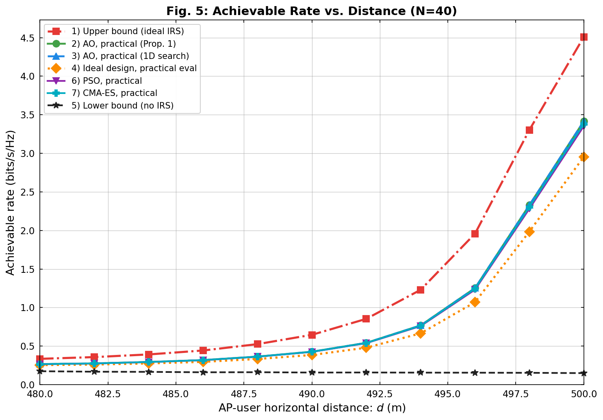
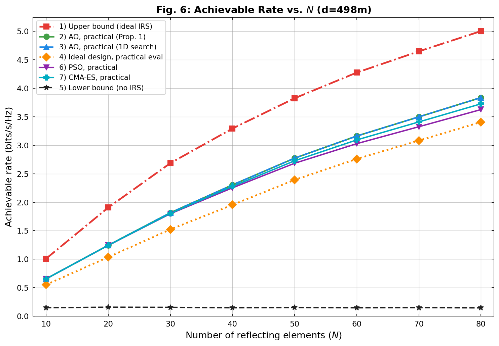
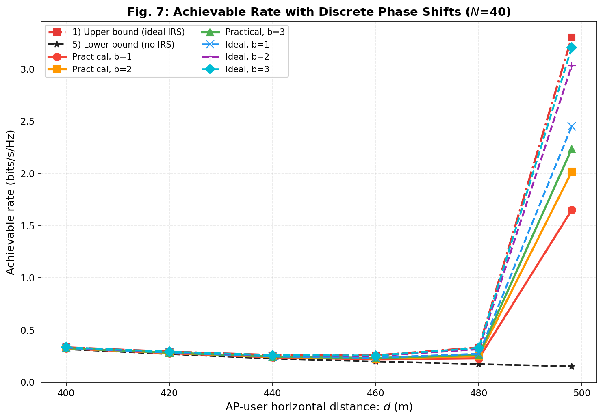
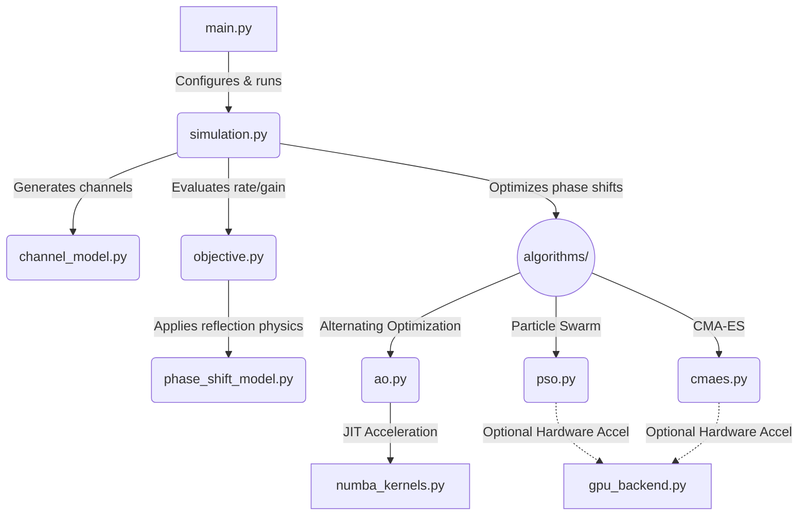

<div align="center">
  <h1>IRS Phase Shift Optimization</h1>
  <p><strong>Maximizing Spectrum Efficiency in Intelligent Reflecting Surface-Aided Wireless Networks</strong></p>
</div>

<br />

## Introduction
Intelligent Reflecting Surfaces (IRS) have emerged as a disruptive technology capable of smartly reconfiguring the wireless propagation environment. By intelligently tuning the phase shifts of massive numbers of low-cost passive reflecting elements, an IRS can significantly enhance signal quality at the receiver. 

This repository provides a comprehensive simulation framework to optimize the **achievable rate (spectrum efficiency)** of an IRS-aided wireless communication system. It features a deep comparative analysis between **ideal** reflection models and **practical** reflection models (where the reflection amplitude is fundamentally coupled with the phase shift).

## Reference Paper
The models and optimization schemes in this repository are inspired by state-of-the-art literature on practical IRS phase shift modeling. The codebase is designed to reproduce the findings that ignoring the amplitude-phase coupling in IRS elements leads to sub-optimal designs, and that specialized algorithms are required to unlock the true potential of practical IRS hardware.

## The Approach
Optimizing the phase shifts of an IRS is a highly non-convex problem. To tackle this, we implement and benchmark three distinct algorithmic approaches:

1. **Alternating Optimization (AO) [Baseline]**
   A rigorous coordinate-descent approach leveraging Numba JIT compilation for blazing-fast CPU execution.
2. **Particle Swarm Optimization (PSO)**
   A meta-heuristic algorithm utilizing multi-strategy initialization, ring topologies, and constriction factors for robust multi-modal search space exploration.
3. **Covariance Matrix Adaptation Evolution Strategy (CMA-ES)**
   An advanced evolutionary strategy that adaptively updates its search distribution to find the global optimum.

## Achieved Results

### Comparisons with Reference Paper
This simulation framework successfully reproduces the key findings from the original literature:
- **Rate vs. Distance (Fig. 5):** The generated curves accurately reflect the paper's results, showing that the practical phase shift model introduces a noticeable performance gap compared to the ideal model. This gap is most prominent when the user is located at intermediate distances where the reflected path dominates.
- **Scaling with N (Fig. 6):** The simulation confirms the theoretical power gain scaling when using continuous phase shifts, while also accurately depicting the scaling penalties induced by the amplitude-phase coupling in practical scenarios.
- **Discrete Phase Shifts (Fig. 7):** As established in the literature, the results confirm that using 2-bit or 3-bit discrete phase shifts achieves performance that is nearly identical to the continuous phase shift case, serving as a highly cost-effective design choice for practical IRS deployments.

### Simulation Figures
Here are the simulation results demonstrating the performance of the various algorithms under different system parameters:

### 1. Achievable Rate vs. AP-User Distance
Demonstrates how the system performs as the distance between the Access Point and the user increases.
<p align="center">
  
</p>

### 2. Achievable Rate vs. Number of Reflecting Elements (N)
Illustrates the scaling behavior of the achievable rate as more IRS elements are added.
<p align="center">
  
</p>

### 3. Impact of Discrete Phase Shifts
Evaluates the performance degradation when the IRS is constrained to low-resolution discrete phase shifts (e.g., 1-bit, 2-bit, or 3-bit).
<p align="center">
  
</p>

## Codebase Analysis & Architecture



The repository is structured as follows to ensure modularity and scalability:

- **`main.py`**: The primary execution script. Routes the simulations for all figures.
- **`simulation.py`**: The engine driving the simulations. Features built-in multiprocessing to parallelize independent channel realizations across multiple CPU cores.
- **`channel_model.py` / `phase_shift_model.py`**: Core mathematical definitions for the fading channels and the IRS reflection physics.
- **`algorithms/`**: Contains the implementations for the optimizers (`ao.py`, `pso.py`, `cmaes.py`).
- **`numba_kernels.py`**: JIT-compiled C-level bypasses for Python's standard execution, drastically speeding up the AO algorithm.
- **`gpu_backend.py`**: A CuPy-driven backend for hardware-accelerated batch processing of meta-heuristic populations.

## How to Apply (Usage Guide)

### Prerequisites
Ensure you have Python 3.8 or higher installed. Clone this repository and install the dependencies:
```bash
git clone https://github.com/tuankhai1/IRS-PHASE-SHIFT-OPTIMIZATION.git
cd IRS-PHASE-SHIFT-OPTIMIZATION
pip install numpy matplotlib numba scipy
```
*(Optional: Install `cupy` if you intend to utilize the GPU backend).*

### Running the Simulations
To run the full suite of simulations (1000 channel realizations per scenario):
```bash
python main.py
```

To run a rapid test cycle (useful for verifying dependencies, runs only 20 realizations):
```bash
python main.py --quick
```

To run a specific simulation figure independently:
```bash
python main.py --fig 5  # Fig. 5: Rate vs. Distance
python main.py --fig 6  # Fig. 6: Rate vs. N
python main.py --fig 7  # Fig. 7: Discrete phase shifts
```

### Outputs
All simulation results are automatically serialized as `.npz` files and plotted as `.png` files inside the `results/` directory.

---
*Created for the advancement of Intelligent Reflecting Surface research.*
