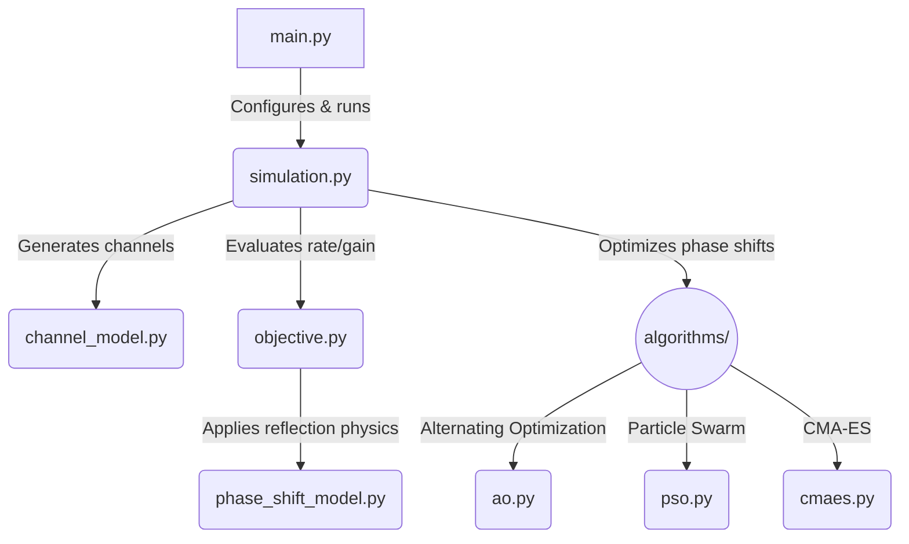

<div align="center">
  <h1>IRS Phase Shift Optimization</h1>
  <p><strong>Maximizing Spectrum Efficiency in Intelligent Reflecting Surface-Aided Wireless Networks</strong></p>
  <p>
    <a href="./PhaseShift_Model.pdf">📄 Read the Reference Paper</a> |
    <a href="./PSO_Report.pdf">📄 Read the PSO Report</a>
  </p>
</div>

<br />

## Introduction

Intelligent Reflecting Surfaces (IRS) have emerged as a disruptive technology capable of smartly reconfiguring the wireless propagation environment. By intelligently tuning the phase shifts of massive numbers of low-cost passive reflecting elements, an IRS can significantly enhance signal quality at the receiver.

This repository provides a comprehensive simulation framework to optimize the **achievable rate (spectrum efficiency)** of an IRS-aided wireless communication system. It features a deep comparative analysis between **ideal** reflection models and **practical** reflection models (where the reflection amplitude is fundamentally coupled with the phase shift).

## Reference Paper

The models and optimization schemes in this repository are inspired by state-of-the-art literature on practical IRS phase shift modeling. The codebase is designed to reproduce the findings that ignoring the amplitude-phase coupling in IRS elements leads to sub-optimal designs, and that specialized algorithms are required to unlock the true potential of practical IRS hardware.

## The Approach

Optimizing the phase shifts of an IRS is a highly non-convex problem. To tackle this, we implement and benchmark three distinct algorithmic approaches:

1. **Alternating Optimization (AO) [Baseline]**
   A rigorous coordinate-descent approach for CPU execution.
2. **Particle Swarm Optimization (PSO)**
   A meta-heuristic algorithm utilizing multi-strategy initialization, ring topologies, and constriction factors for robust multi-modal search space exploration.
3. **Covariance Matrix Adaptation Evolution Strategy (CMA-ES)**
   An advanced evolutionary strategy that adaptively updates its search distribution to find the global optimum.

## Achieved Results

### Comparisons with Reference Paper

This simulation framework successfully reproduces the key findings from the original literature:

- **Rate vs. Distance (Fig. 5):** The generated curves accurately reflect the paper's results, showing that the practical phase shift model introduces a noticeable performance gap compared to the ideal model. This gap is most prominent when the user is located at intermediate distances where the reflected path dominates.
- **Scaling with N (Fig. 6):** The simulation confirms the theoretical power gain scaling when using continuous phase shifts, while also accurately depicting the scaling penalties induced by the amplitude-phase coupling in practical scenarios.
- **Discrete Phase Shifts (Fig. 7):** As established in the literature, the results confirm that using 2-bit or 3-bit discrete phase shifts achieves performance that is nearly identical to the continuous phase shift case, serving as a highly cost-effective design choice for practical IRS deployments.

### Simulation Figures

Here are the simulation results demonstrating the performance of the various algorithms under different system parameters:

### 1. Achievable Rate vs. AP-User Distance

Demonstrates how the system performs as the distance between the Access Point and the user increases.
<p align="center">
  
</p>

#### Detailed Result Table (Fig. 5)

| Scheme | 480 | 482 | 484 | 486 | 488 | 490 | 492 | 494 | 496 | 498 | 500 |
|:---| ---: | ---: | ---: | ---: | ---: | ---: | ---: | ---: | ---: | ---: | ---: |
| upper_bound | 0.3354 | 0.3580 | 0.3926 | 0.4436 | 0.5260 | 0.6467 | 0.8538 | 1.2305 | 1.9588 | 3.3039 | 4.5096 |
| ao_practical_prop1 | 0.2672 | 0.2762 | 0.2945 | 0.3192 | 0.3643 | 0.4278 | 0.5428 | 0.7689 | 1.2535 | 2.3301 | 3.4178 |
| ao_practical_1d | 0.2672 | 0.2762 | 0.2945 | 0.3192 | 0.3643 | 0.4278 | 0.5428 | 0.7689 | 1.2535 | 2.3301 | 3.4178 |
| ideal_design_practical_eval | 0.2544 | 0.2610 | 0.2762 | 0.2961 | 0.3334 | 0.3853 | 0.4799 | 0.6661 | 1.0700 | 1.9858 | 2.9552 |
| lower_bound | 0.1747 | 0.1683 | 0.1664 | 0.1610 | 0.1618 | 0.1576 | 0.1584 | 0.1565 | 0.1556 | 0.1540 | 0.1501 |
| pso_practical | 0.2664 | 0.2753 | 0.2934 | 0.3178 | 0.3623 | 0.4249 | 0.5381 | 0.7598 | 1.2320 | 2.2818 | 3.3522 |
| cmaes_practical | 0.2669 | 0.2758 | 0.2941 | 0.3186 | 0.3634 | 0.4266 | 0.5407 | 0.7648 | 1.2432 | 2.3038 | 3.3808 |

### 2. Achievable Rate vs. Number of Reflecting Elements (N)

Illustrates the scaling behavior of the achievable rate as more IRS elements are added.
<p align="center">
  
</p>

#### Detailed Result Table (Fig. 6)

| Scheme | 10 | 20 | 30 | 40 | 50 | 60 | 70 | 80 |
|:---| ---: | ---: | ---: | ---: | ---: | ---: | ---: | ---: |
| upper_bound | 1.0105 | 1.9065 | 2.6857 | 3.2936 | 3.8243 | 4.2746 | 4.6474 | 5.0021 |
| ao_practical_prop1 | 0.6559 | 1.2447 | 1.8150 | 2.3041 | 2.7730 | 3.1611 | 3.4979 | 3.8357 |
| ao_practical_1d | 0.6559 | 1.2447 | 1.8150 | 2.3041 | 2.7730 | 3.1611 | 3.4979 | 3.8357 |
| ideal_design_practical_eval | 0.5522 | 1.0364 | 1.5230 | 1.9538 | 2.3916 | 2.7599 | 3.0815 | 3.4062 |
| lower_bound | 0.1490 | 0.1575 | 0.1550 | 0.1478 | 0.1522 | 0.1476 | 0.1506 | 0.1463 |
| pso_practical | 0.6560 | 1.2429 | 1.7981 | 2.2530 | 2.6837 | 3.0273 | 3.3247 | 3.6258 |
| cmaes_practical | 0.6559 | 1.2432 | 1.8046 | 2.2770 | 2.7268 | 3.0927 | 3.4089 | 3.7262 |

### 3. Impact of Discrete Phase Shifts

Evaluates the performance degradation when the IRS is constrained to low-resolution discrete phase shifts (e.g., 1-bit, 2-bit, or 3-bit).
<p align="center">
  
</p>

#### Detailed Result Table (Fig. 7)

| Scheme | 400 | 420 | 440 | 460 | 480 | 498 |
|:---| ---: | ---: | ---: | ---: | ---: | ---: |
| upper_bound | 0.3337 | 0.2920 | 0.2591 | 0.2557 | 0.3328 | 3.3028 |
| lower_bound | 0.3155 | 0.2682 | 0.2255 | 0.1979 | 0.1723 | 0.1501 |
| ao_practical_discrete_1 | 0.3223 | 0.2770 | 0.2380 | 0.2192 | 0.2279 | 1.6485 |
| ao_ideal_discrete_1 | 0.3271 | 0.2832 | 0.2467 | 0.2340 | 0.2707 | 2.4467 |
| ao_practical_discrete_2 | 0.3247 | 0.2802 | 0.2424 | 0.2268 | 0.2489 | 2.0150 |
| ao_ideal_discrete_2 | 0.3308 | 0.2881 | 0.2536 | 0.2461 | 0.3046 | 2.8653 |
| ao_practical_discrete_3 | 0.3260 | 0.2818 | 0.2447 | 0.2308 | 0.2598 | 2.2339 |
| ao_ideal_discrete_3 | 0.3313 | 0.2888 | 0.2546 | 0.2478 | 0.3089 | 2.9126 |

## Codebase Analysis & Architecture



The repository is structured as follows to ensure modularity and scalability:

```text
.
├── config.py                 # System parameters, constants, and hyperparameters
├── main.py                   # Primary execution script routing simulations for all figures
├── objective.py              # Objective function and achievable rate calculations
├── phase_shift_model.py      # Core mathematical definitions for IRS reflection physics
├── channel_model.py          # Generation of Rayleigh fading channels with path loss
├── simulation.py             # Simulation engine driving parallelized channel realizations
├── plot_results.py           # Generation of figures and visualizations using matplotlib
├── algorithms/
│   ├── ao.py                 # Alternating Optimization algorithm implementation (Baseline)
│   ├── pso.py                # Particle Swarm Optimization algorithm implementation
│   └── cmaes.py              # Covariance Matrix Adaptation Evolution Strategy implementation
├── assets/                   # Saved simulation plots for README documentation
├── PSO_Report.pdf            # PDF report detailing PSO implementation
└── PhaseShift_Model.pdf      # Reference paper detailing the phase shift model
```

## How to Apply (Usage Guide)

### Prerequisites

Ensure you have Python 3.8 or higher installed. Clone this repository and install the dependencies:

```bash
git clone https://github.com/tuankhai1/IRS-PHASE-SHIFT-OPTIMIZATION.git
cd IRS-PHASE-SHIFT-OPTIMIZATION
pip install numpy matplotlib scipy
```

### Running the Simulations

To run the full suite of simulations (1000 channel realizations per scenario):

```bash
python main.py
```

To run a rapid test cycle (useful for verifying dependencies, runs only 20 realizations):

```bash
python main.py --quick
```

To run a specific simulation figure independently:

```bash
python main.py --fig 5  # Fig. 5: Rate vs. Distance
python main.py --fig 6  # Fig. 6: Rate vs. N
python main.py --fig 7  # Fig. 7: Discrete phase shifts
```

### Outputs

All simulation results are automatically serialized as `.npz` files and plotted as `.png` files inside the `results/` directory.


---
*Created for the advancement of Intelligent Reflecting Surface research.*
