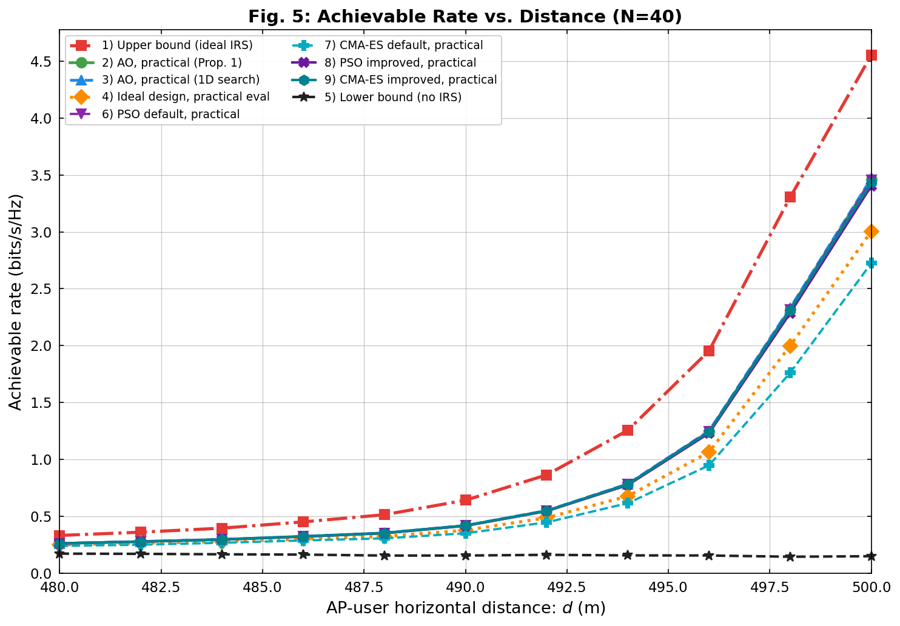
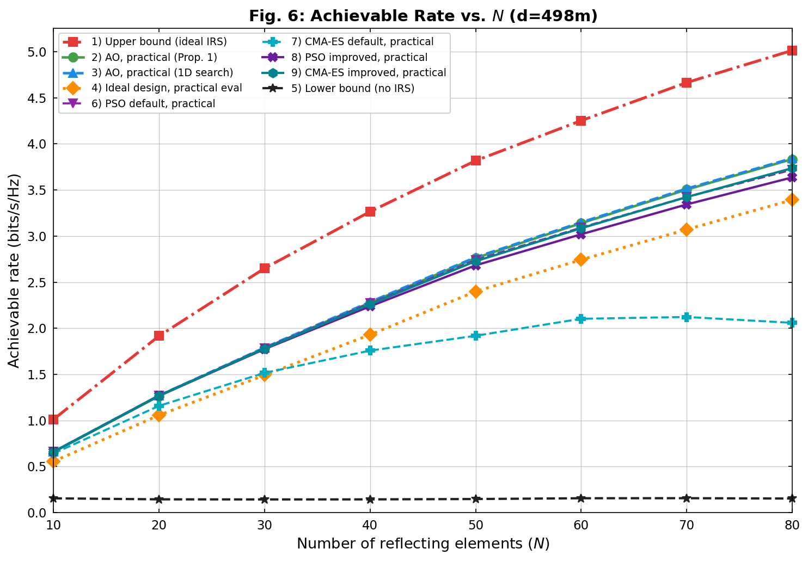
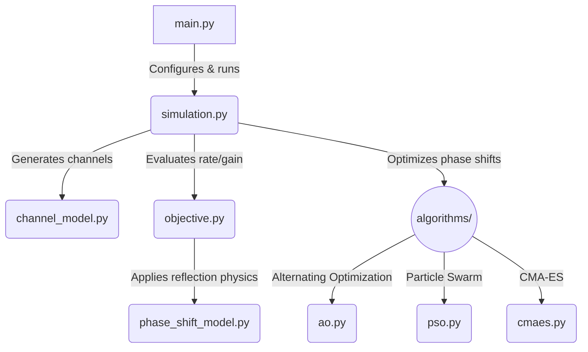

<div align="center">
  <h1>IRS Phase Shift Optimization</h1>
  <p><strong>Maximizing Spectrum Efficiency in Intelligent Reflecting Surface-Aided Wireless Networks</strong></p>
  <p>
    <a href="./PhaseShift_Model.pdf">Read the Reference Paper</a> |
    <a href="./PSO_Report.pdf">Read the PSO Report</a>
  </p>
</div>

<br />

## Introduction

Intelligent Reflecting Surfaces (IRS) have emerged as a disruptive technology
capable of smartly reconfiguring the wireless propagation environment. By
intelligently tuning the phase shifts of massive numbers of low-cost passive
reflecting elements, an IRS can significantly enhance signal quality at the
receiver.

This repository provides a simulation framework to optimize the **achievable
rate (spectrum efficiency)** of an IRS-aided wireless communication system. It
compares **ideal** reflection models with **practical** reflection models where
the reflection amplitude is coupled with the phase shift.

## Reference Paper

The models and optimization schemes in this repository are inspired by the
reference paper on practical IRS phase shift modeling. The codebase is designed
to reproduce the main findings that ignoring amplitude-phase coupling in IRS
elements leads to sub-optimal designs, and that specialized algorithms are
required to unlock the potential of practical IRS hardware.

## The Approach

Optimizing the phase shifts of an IRS is a highly non-convex problem. The
default simulation pipeline follows the reference paper's AO-based schemes:

1. **Alternating Optimization (AO) [Baseline]**
   A coordinate-descent approach for CPU execution.
2. **Ideal-model design with practical evaluation**
   A paper baseline showing the loss caused by ignoring amplitude-phase
   coupling during design.
3. **No-IRS lower bound and discrete phase-shift variants**
   Baselines used to reproduce the paper's continuous and discrete phase-shift
   figures.

The continuous-phase figures also include default and improved PSO/CMA-ES
variants for comparison against AO under the same channel realizations and
practical phase-shift objective.

## Current Pipeline

The simulation pipeline keeps the paper settings fixed and adds PSO/CMA-ES only
as comparison optimizers. The paper-aligned schemes are:

- `upper_bound`: ideal phase-shift model.
- `ao_practical_prop1`: AO with the practical model and Proposition 1.
- `ao_practical_1d`: AO with the practical model and 1D search.
- `ideal_design_practical_eval`: ideal-model design evaluated with the
  practical model.
- `lower_bound`: no IRS.

For Fig. 5 and Fig. 6, the following additional optimizers are run under the
same channel realizations and practical phase-shift objective:

- `pso_default`: standard global-best PSO baseline.
- `cmaes_default`: standard single-start CMA-ES baseline.
- `pso_practical`: improved PSO variant.
- `cmaes_practical`: improved CMA-ES variant.

Fig. 7 remains the paper's discrete phase-shift comparison for `b = 1, 2, 3`.

## Generated Results

Running the simulations writes all numerical results and generated figures to
`results/`. The result snapshots below are generated from the current `.npz`
files. Each figure uses `300` channel realizations per x-axis value.

```text
results/results_fig5.npz
results/results_fig6.npz
results/results_fig7.npz
results/fig5_rate_vs_distance.png
results/fig6_rate_vs_N.png
results/fig7_discrete_phases.png
results/runtime_table_fig5.md
results/runtime_table_fig6.md
results/runtime_table_fig7.md
```

The runtime tables report mean runtime per channel realization at each x-axis
value, plus overall mean runtime per realization and total CPU time for each
scheme.

### Fig. 5: Achievable Rate vs. AP-User Distance



Detailed result table, in bit/s/Hz:

| Scheme | 480 | 482 | 484 | 486 | 488 | 490 | 492 | 494 | 496 | 498 | 500 |
| :--- | ---: | ---: | ---: | ---: | ---: | ---: | ---: | ---: | ---: | ---: | ---: |
| upper_bound | 0.33 | 0.36 | 0.40 | 0.45 | 0.52 | 0.64 | 0.87 | 1.26 | 1.95 | 3.30 | 4.55 |
| ao_practical_prop1 | 0.26 | 0.28 | 0.30 | 0.32 | 0.35 | 0.42 | 0.55 | 0.78 | 1.25 | 2.32 | 3.46 |
| ao_practical_1d | 0.26 | 0.28 | 0.30 | 0.33 | 0.35 | 0.42 | 0.55 | 0.79 | 1.25 | 2.33 | 3.47 |
| ideal_design_practical_eval | 0.25 | 0.26 | 0.28 | 0.30 | 0.32 | 0.38 | 0.49 | 0.68 | 1.06 | 2.00 | 3.00 |
| lower_bound | 0.17 | 0.17 | 0.17 | 0.16 | 0.16 | 0.16 | 0.16 | 0.16 | 0.16 | 0.15 | 0.15 |
| pso_default | 0.26 | 0.28 | 0.30 | 0.32 | 0.35 | 0.42 | 0.55 | 0.78 | 1.25 | 2.32 | 3.45 |
| cmaes_default | 0.24 | 0.25 | 0.27 | 0.29 | 0.31 | 0.35 | 0.45 | 0.62 | 0.95 | 1.76 | 2.72 |
| pso_practical | 0.26 | 0.28 | 0.30 | 0.32 | 0.35 | 0.42 | 0.55 | 0.78 | 1.23 | 2.29 | 3.40 |
| cmaes_practical | 0.26 | 0.28 | 0.30 | 0.32 | 0.35 | 0.42 | 0.55 | 0.78 | 1.24 | 2.31 | 3.43 |

Runtime comparison: [results/runtime_table_fig5.md](results/runtime_table_fig5.md)

### Fig. 6: Achievable Rate vs. Number of IRS Elements



Detailed result table, in bit/s/Hz:

| Scheme | 10 | 20 | 30 | 40 | 50 | 60 | 70 | 80 |
| :--- | ---: | ---: | ---: | ---: | ---: | ---: | ---: | ---: |
| upper_bound | 1.01 | 1.92 | 2.65 | 3.27 | 3.82 | 4.25 | 4.66 | 5.01 |
| ao_practical_prop1 | 0.66 | 1.27 | 1.78 | 2.28 | 2.76 | 3.14 | 3.50 | 3.83 |
| ao_practical_1d | 0.66 | 1.27 | 1.79 | 2.29 | 2.77 | 3.15 | 3.51 | 3.84 |
| ideal_design_practical_eval | 0.56 | 1.06 | 1.49 | 1.93 | 2.40 | 2.74 | 3.07 | 3.39 |
| lower_bound | 0.16 | 0.14 | 0.14 | 0.14 | 0.15 | 0.16 | 0.16 | 0.15 |
| pso_default | 0.66 | 1.27 | 1.79 | 2.27 | 2.74 | 3.09 | 3.42 | 3.72 |
| cmaes_default | 0.64 | 1.16 | 1.52 | 1.76 | 1.92 | 2.10 | 2.12 | 2.06 |
| pso_practical | 0.66 | 1.27 | 1.77 | 2.24 | 2.68 | 3.02 | 3.34 | 3.64 |
| cmaes_practical | 0.66 | 1.27 | 1.78 | 2.26 | 2.73 | 3.09 | 3.42 | 3.74 |

Runtime comparison: [results/runtime_table_fig6.md](results/runtime_table_fig6.md)

### Fig. 7: Discrete Phase-Shift Comparison


Detailed result table, in bit/s/Hz:

| Scheme | 400 | 420 | 440 | 460 | 480 | 498 |
| :--- | ---: | ---: | ---: | ---: | ---: | ---: |
| upper_bound | 0.35 | 0.29 | 0.26 | 0.26 | 0.33 | 3.28 |
| lower_bound | 0.33 | 0.27 | 0.23 | 0.20 | 0.17 | 0.16 |
| ao_practical_discrete_1 | 0.33 | 0.28 | 0.24 | 0.22 | 0.23 | 1.61 |
| ao_ideal_discrete_1 | 0.34 | 0.28 | 0.25 | 0.24 | 0.27 | 2.43 |
| ao_practical_discrete_2 | 0.34 | 0.28 | 0.24 | 0.23 | 0.25 | 1.99 |
| ao_ideal_discrete_2 | 0.34 | 0.29 | 0.25 | 0.25 | 0.31 | 2.86 |
| ao_practical_discrete_3 | 0.34 | 0.28 | 0.24 | 0.23 | 0.26 | 2.21 |
| ao_ideal_discrete_3 | 0.34 | 0.29 | 0.25 | 0.25 | 0.31 | 2.92 |

Runtime comparison: [results/runtime_table_fig7.md](results/runtime_table_fig7.md)

## Codebase Analysis & Architecture



The repository is structured as follows to keep the simulation pipeline modular:

```text
.
|-- config.py                     # System parameters and optimizer settings
|-- main.py                       # CLI entry point for simulation figures
|-- simulation.py                 # Experiment orchestration
|-- plot_results.py               # Simulation plotting functions
|-- channel_model.py              # Wireless channel generation
|-- objective.py                  # Achievable-rate objective functions
|-- phase_shift_model.py          # Practical IRS reflection model
|-- algorithms/
|   |-- ao.py                     # Alternating Optimization baseline
|   |-- pso.py                    # Particle Swarm Optimization
|   `-- cmaes.py                  # CMA-ES
|-- results/                      # Generated figures, npz files, and runtime tables
|-- assets/                       # Optional published figures
|-- PSO_Report.pdf                # Compiled PSO report
`-- PhaseShift_Model.pdf          # Reference paper
```

## How to Apply (Usage Guide)

### Prerequisites

Ensure you have Python 3.10 or newer installed. Clone this repository and
install the dependencies:

```bash
git clone https://github.com/tuankhai1/IRS-PHASE-SHIFT-OPTIMIZATION.git
cd IRS-PHASE-SHIFT-OPTIMIZATION
python -m pip install -r requirements.txt
```

### Running the Simulations

To run the full suite of simulations with the default realization count:

```bash
python main.py
```

To run a smaller test cycle:

```bash
python main.py --realizations 20
```

To run a specific simulation figure independently:

```bash
python main.py --fig 5  # Fig. 5: Rate vs. Distance
python main.py --fig 6  # Fig. 6: Rate vs. N
python main.py --fig 7  # Fig. 7: Discrete phase shifts
```

The base random seed is fixed in `config.py` for reproducibility.

### Outputs

All simulation results are automatically serialized as `.npz` files and plotted
as `.png` files inside the `results/` directory. Runtime comparison tables are
also written as Markdown files in the same directory.

---

Created for the advancement of Intelligent Reflecting Surface research.
