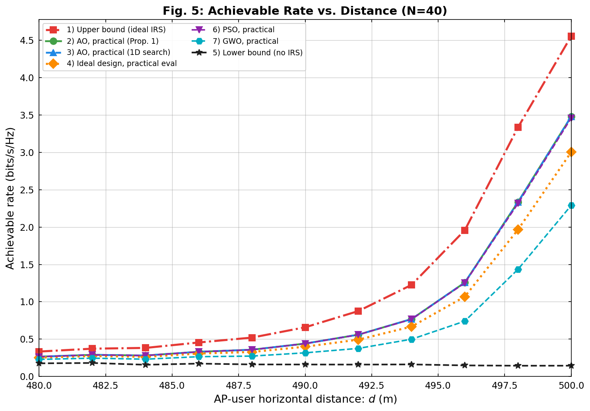
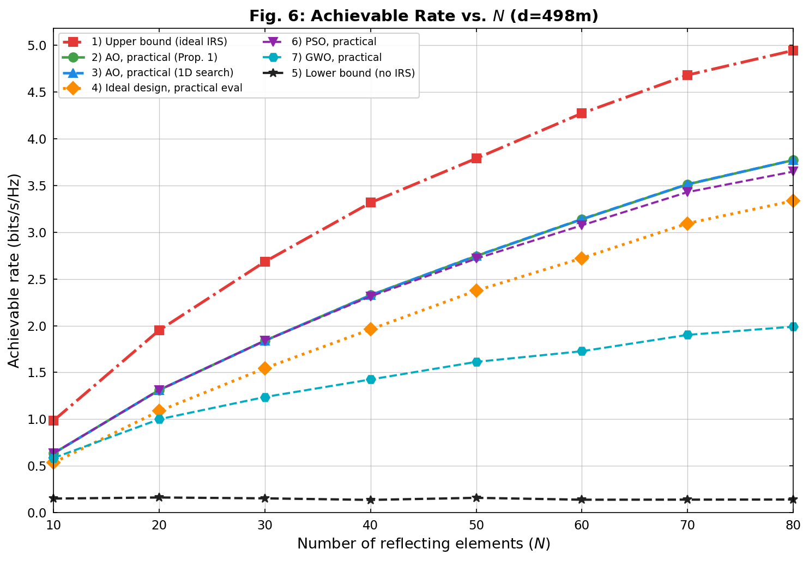
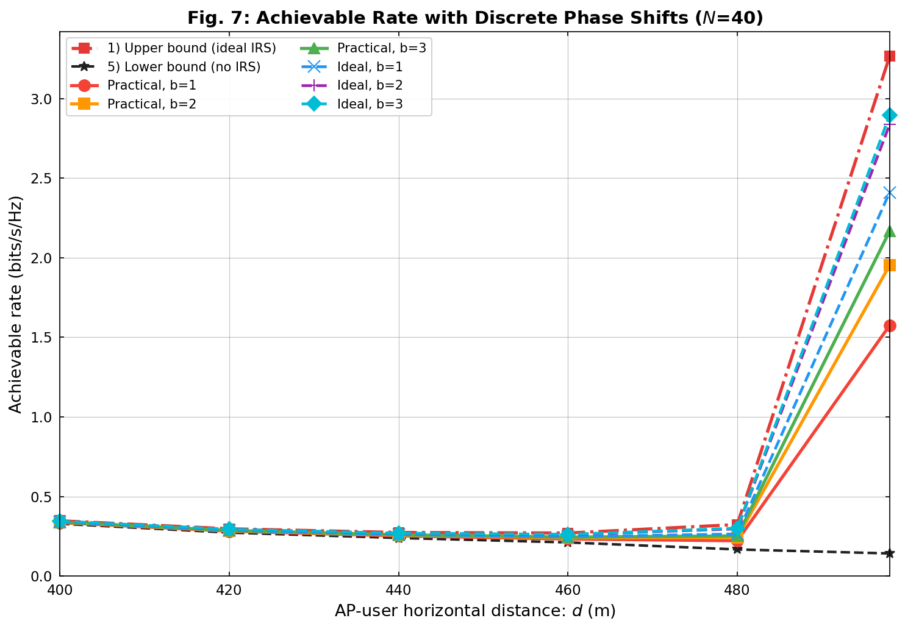
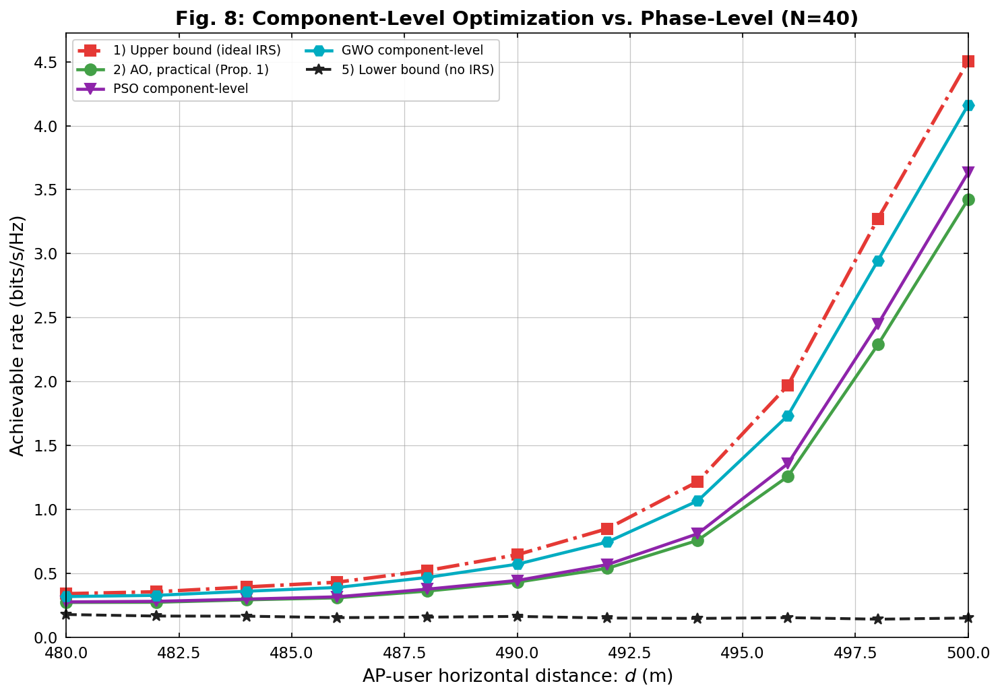
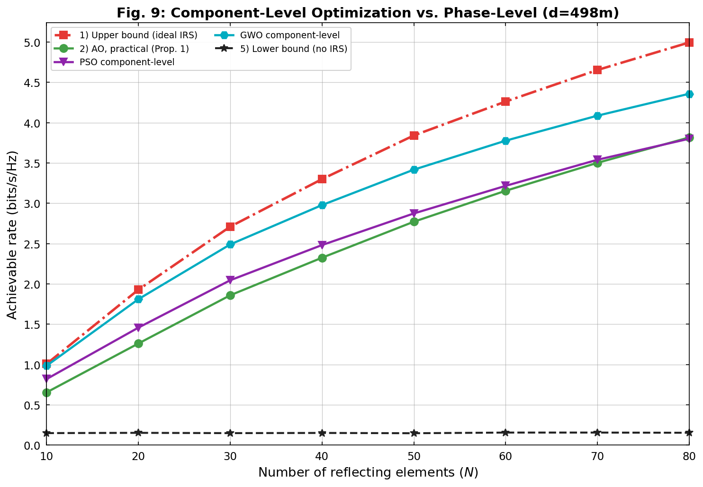
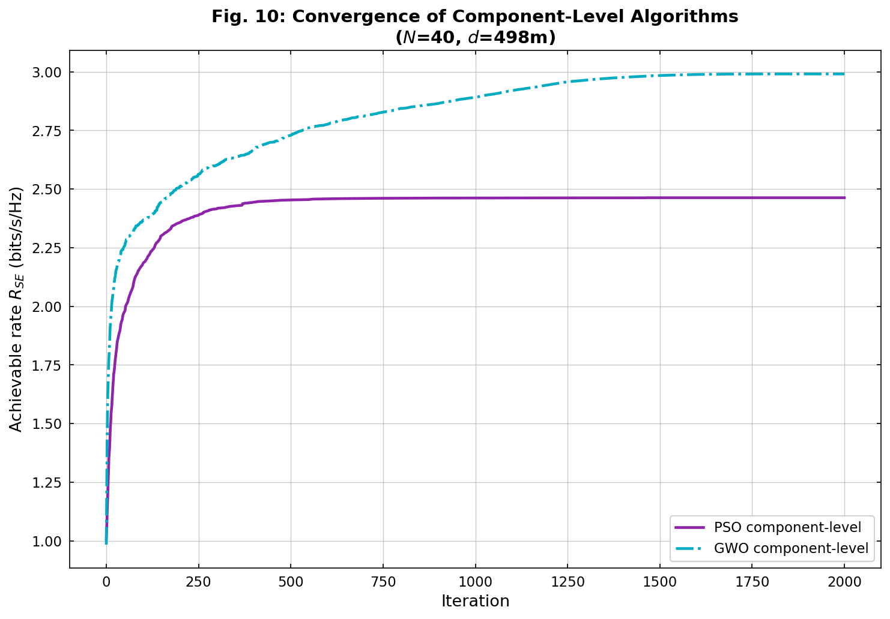
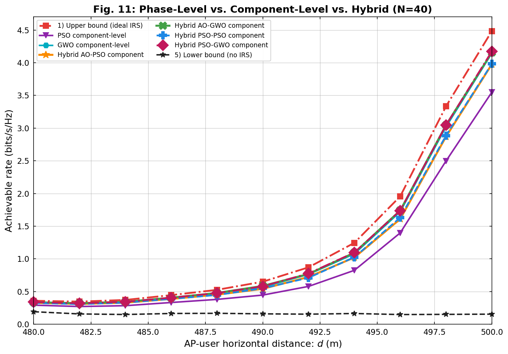
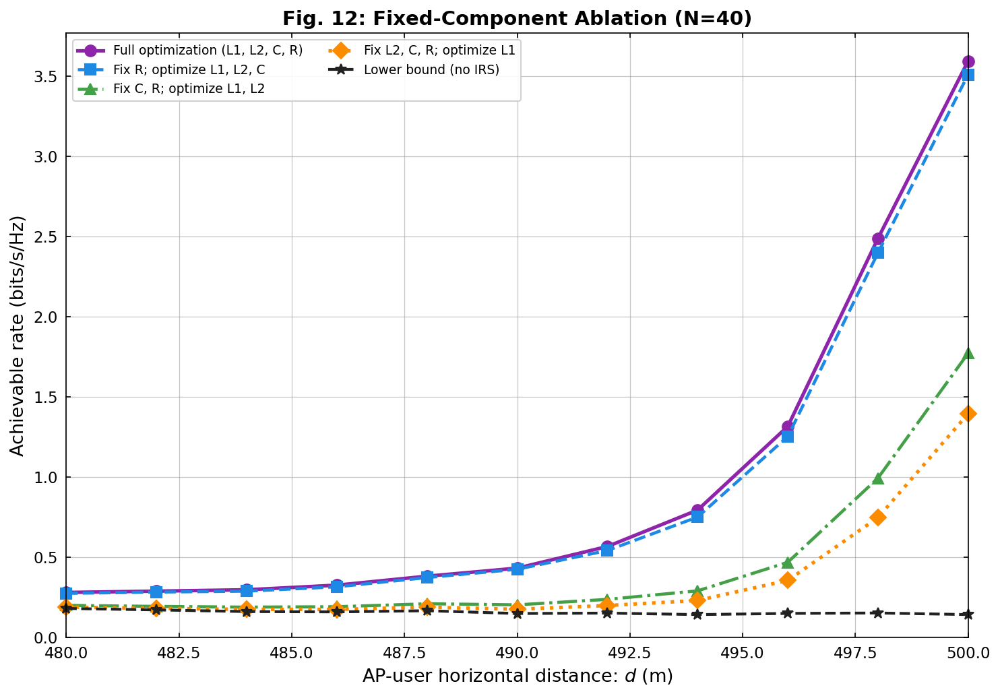
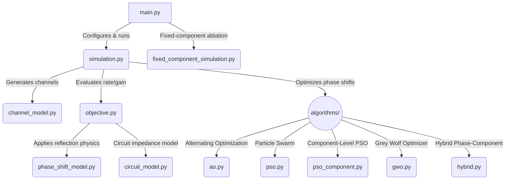

<div align="center">
  <h1>IRS Phase Shift Optimization</h1>
  <p><strong>Maximizing Spectrum Efficiency in Intelligent Reflecting Surface-Aided Wireless Networks</strong></p>
  <p>
    <a href="./PhaseShift_Model.pdf">Read the Reference Paper</a> |
    <a href="./PSO_Report.pdf">Read the PSO Report</a>
  </p>
</div>

<br />

## Introduction

Intelligent Reflecting Surfaces (IRS) have emerged as a disruptive technology
capable of smartly reconfiguring the wireless propagation environment. By
intelligently tuning the phase shifts of massive numbers of low-cost passive
reflecting elements, an IRS can significantly enhance signal quality at the
receiver.

This repository provides a simulation framework to optimize the **achievable
rate (spectrum efficiency)** of an IRS-aided wireless communication system. It
compares **ideal** reflection models with **practical** reflection models where
the reflection amplitude is coupled with the phase shift.

Beyond conventional phase-level optimization, this project introduces
**component-level** and **hybrid** optimization that directly tunes the hardware
circuit parameters (inductances, capacitance, resistance) of each IRS element,
capturing the full electromagnetic behavior of the varactor-based circuit rather
than relying on the simplified amplitude-phase coupling model.

## Reference Paper

The models and optimization schemes in this repository are inspired by the
reference paper on practical IRS phase shift modeling. The codebase is designed
to reproduce the main findings that ignoring amplitude-phase coupling in IRS
elements leads to sub-optimal designs, and that specialized algorithms are
required to unlock the potential of practical IRS hardware.

## The Approach

Optimizing the phase shifts of an IRS is a highly non-convex problem. The
simulation pipeline explores optimization at **three levels of abstraction**:

### Phase-Level Optimization

Optimizes the continuous phase shift vector θ = [θ₁, θ₂, …, θ_N] under both
the ideal and practical reflection models:

1. **Alternating Optimization (AO) [Baseline]**
   A coordinate-descent approach from the reference paper.
2. **Particle Swarm Optimization (PSO)**
   Population-based metaheuristic with Clerc's constriction coefficients.
3. **Grey Wolf Optimizer (GWO)**
   Metaheuristic inspired by the social hierarchy and hunting behavior of grey
   wolves.
4. **Ideal-model design with practical evaluation**
   A paper baseline showing the loss caused by ignoring amplitude-phase
   coupling during design.
5. **No-IRS lower bound and discrete phase-shift variants**
   Baselines used to reproduce the paper's continuous and discrete phase-shift
   figures.

### Component-Level Optimization

Directly optimizes the hardware circuit parameters {L₁, L₂, C, R} of each IRS
element. Each element is modeled as a parallel resonant circuit at 5.8 GHz, and
the reflection coefficient is derived from the impedance mismatch with
free-space impedance (Z₀ = 377 Ω). This operates in a **4N-dimensional** search
space (e.g., 160 dimensions for N = 40):

- **Component-level PSO** — 200 particles, 2000 iterations, absorbing-wall
  boundary handling.
- **Component-level GWO** — 200 wolves, 2000 iterations, quartic decay for the
  control parameter *a*.

### Hybrid Phase-Component Optimization

A multi-stage pipeline that warm-starts the component-level optimizer using the
analytical phase-level solution:

1. **Phase-level solve** (AO or PSO) → target phases θ*
2. **Inverse mapping** → approximate hardware parameters via random sampling
3. **Warm-started population** (50 % near inverse-mapped, 50 % random)
4. **Component-level refinement** (PSO or GWO)

Four hybrid variants are implemented: **AO+PSO**, **AO+GWO**, **PSO+PSO**, and
**PSO+GWO**.

## Current Pipeline

The simulation pipeline keeps the paper settings fixed and adds
metaheuristic / component-level comparisons. The paper-aligned schemes are:

- `upper_bound`: ideal phase-shift model.
- `ao_practical_prop1`: AO with the practical model and Proposition 1.
- `ao_practical_1d`: AO with the practical model and 1D search.
- `ideal_design_practical_eval`: ideal-model design evaluated with the
  practical model.
- `lower_bound`: no IRS.

For Fig. 5 and Fig. 6, the following additional optimizers are run under the
same channel realizations and practical phase-shift objective:

- `pso`: standard global-best PSO.
- `cmaes_default`: standard single-start CMA-ES baseline.
- `cmaes_practical`: improved CMA-ES variant.

Fig. 7 remains the paper's discrete phase-shift comparison for `b = 1, 2, 3`.

For Fig. 8–12, component-level and hybrid optimizers are compared against AO:

- `pso_component`: component-level PSO (4N dimensions).
- `apso_component`: component-level PSO with AO warm-start.
- `gwo_component`: component-level GWO (4N dimensions).
- `hybrid_ao_pso_component`, `hybrid_ao_gwo_component`: AO → component PSO/GWO.
- `hybrid_pso_pso_component`, `hybrid_pso_gwo_component`: PSO → component
  PSO/GWO.

## Generated Results

Running the simulations writes all numerical results and generated figures to
`results/`. The result snapshots below are generated from the current `.npz`
files. Each figure uses `300` channel realizations per x-axis value (phase-level
figures) or `100` realizations (component-level figures).

```text
results/results_fig5.npz          results/fig5_rate_vs_distance.png
results/results_fig6.npz          results/fig6_rate_vs_N.png
results/results_fig7.npz          results/fig7_discrete_phases.png
results/results_fig8.npz          results/fig8_component_vs_distance.png
results/results_fig9.npz          results/fig9_component_vs_N.png
results/results_fig10.npz         results/fig10_convergence.png
results/results_fig11.npz         results/fig11_phase_vs_component.png
results/results_fig12.npz         results/fig12_fixed_component_ablation.png
results/runtime_table_fig*.md
```

The runtime tables report mean runtime per channel realization at each x-axis
value, plus overall mean runtime per realization and total CPU time for each
scheme.

---

### Phase-Level Results

#### Fig. 5: Achievable Rate vs. AP-User Distance



Detailed result table, in bit/s/Hz:

| Scheme | 480 | 482 | 484 | 486 | 488 | 490 | 492 | 494 | 496 | 498 | 500 |
| :--- | ---: | ---: | ---: | ---: | ---: | ---: | ---: | ---: | ---: | ---: | ---: |
| upper_bound | 0.33 | 0.36 | 0.40 | 0.45 | 0.52 | 0.64 | 0.87 | 1.26 | 1.95 | 3.30 | 4.55 |
| ao_practical_prop1 | 0.26 | 0.28 | 0.30 | 0.32 | 0.35 | 0.42 | 0.55 | 0.78 | 1.25 | 2.32 | 3.46 |
| ao_practical_1d | 0.26 | 0.28 | 0.30 | 0.33 | 0.35 | 0.42 | 0.55 | 0.79 | 1.25 | 2.33 | 3.47 |
| ideal_design_practical_eval | 0.25 | 0.26 | 0.28 | 0.30 | 0.32 | 0.38 | 0.49 | 0.68 | 1.06 | 2.00 | 3.00 |
| lower_bound | 0.17 | 0.17 | 0.17 | 0.16 | 0.16 | 0.16 | 0.16 | 0.16 | 0.16 | 0.15 | 0.15 |
| pso | 0.26 | 0.28 | 0.30 | 0.32 | 0.35 | 0.42 | 0.55 | 0.78 | 1.25 | 2.32 | 3.45 |
| cmaes_default | 0.24 | 0.25 | 0.27 | 0.29 | 0.31 | 0.35 | 0.45 | 0.62 | 0.95 | 1.76 | 2.72 |
| cmaes_practical | 0.26 | 0.28 | 0.30 | 0.32 | 0.35 | 0.42 | 0.55 | 0.78 | 1.24 | 2.31 | 3.43 |

Runtime comparison: [results/runtime_table_fig5.md](results/runtime_table_fig5.md)

#### Fig. 6: Achievable Rate vs. Number of IRS Elements



Detailed result table, in bit/s/Hz:

| Scheme | 10 | 20 | 30 | 40 | 50 | 60 | 70 | 80 |
| :--- | ---: | ---: | ---: | ---: | ---: | ---: | ---: | ---: |
| upper_bound | 1.01 | 1.92 | 2.65 | 3.27 | 3.82 | 4.25 | 4.66 | 5.01 |
| ao_practical_prop1 | 0.66 | 1.27 | 1.78 | 2.28 | 2.76 | 3.14 | 3.50 | 3.83 |
| ao_practical_1d | 0.66 | 1.27 | 1.79 | 2.29 | 2.77 | 3.15 | 3.51 | 3.84 |
| ideal_design_practical_eval | 0.56 | 1.06 | 1.49 | 1.93 | 2.40 | 2.74 | 3.07 | 3.39 |
| lower_bound | 0.16 | 0.14 | 0.14 | 0.14 | 0.15 | 0.16 | 0.16 | 0.15 |
| pso | 0.66 | 1.27 | 1.79 | 2.27 | 2.74 | 3.09 | 3.42 | 3.72 |
| cmaes_default | 0.64 | 1.16 | 1.52 | 1.76 | 1.92 | 2.10 | 2.12 | 2.06 |
| cmaes_practical | 0.66 | 1.27 | 1.78 | 2.26 | 2.73 | 3.09 | 3.42 | 3.74 |

Runtime comparison: [results/runtime_table_fig6.md](results/runtime_table_fig6.md)

#### Fig. 7: Discrete Phase-Shift Comparison



Detailed result table, in bit/s/Hz:

| Scheme | 400 | 420 | 440 | 460 | 480 | 498 |
| :--- | ---: | ---: | ---: | ---: | ---: | ---: |
| upper_bound | 0.35 | 0.29 | 0.26 | 0.26 | 0.33 | 3.28 |
| lower_bound | 0.33 | 0.27 | 0.23 | 0.20 | 0.17 | 0.16 |
| ao_practical_discrete_1 | 0.33 | 0.28 | 0.24 | 0.22 | 0.23 | 1.61 |
| ao_ideal_discrete_1 | 0.34 | 0.28 | 0.25 | 0.24 | 0.27 | 2.43 |
| ao_practical_discrete_2 | 0.34 | 0.28 | 0.24 | 0.23 | 0.25 | 1.99 |
| ao_ideal_discrete_2 | 0.34 | 0.29 | 0.25 | 0.25 | 0.31 | 2.86 |
| ao_practical_discrete_3 | 0.34 | 0.28 | 0.24 | 0.23 | 0.26 | 2.21 |
| ao_ideal_discrete_3 | 0.34 | 0.29 | 0.25 | 0.25 | 0.31 | 2.92 |

Runtime comparison: [results/runtime_table_fig7.md](results/runtime_table_fig7.md)

---

### Component-Level Results

#### Fig. 8: Component-Level Optimization vs. Distance

Component-level PSO and GWO optimize the hardware parameters {L₁, L₂, C, R}
directly in a 160-dimensional space (4 × 40 elements). GWO's three-leader
guidance mechanism provides superior exploration in this high-dimensional,
multi-modal landscape.



Detailed result table, in bit/s/Hz (N = 40, 100 realizations):

| Scheme | 480 | 482 | 484 | 486 | 488 | 490 | 492 | 494 | 496 | 498 | 500 |
| :--- | ---: | ---: | ---: | ---: | ---: | ---: | ---: | ---: | ---: | ---: | ---: |
| upper_bound | 0.34 | 0.35 | 0.43 | 0.43 | 0.54 | 0.65 | 0.84 | 1.22 | 1.99 | 3.27 | 4.49 |
| ao_practical_prop1 | 0.27 | 0.27 | 0.33 | 0.30 | 0.37 | 0.44 | 0.52 | 0.75 | 1.26 | 2.28 | 3.41 |
| gwo_component | 0.32 | 0.32 | 0.39 | 0.39 | 0.49 | 0.58 | 0.73 | 1.05 | 1.73 | 2.93 | 4.15 |
| pso_component | 0.28 | 0.27 | 0.34 | 0.32 | 0.39 | 0.45 | 0.56 | 0.80 | 1.34 | 2.43 | 3.62 |
| apso_component | 0.27 | 0.27 | 0.33 | 0.31 | 0.37 | 0.43 | 0.53 | 0.76 | 1.26 | 2.32 | 3.52 |
| lower_bound | 0.18 | 0.16 | 0.19 | 0.15 | 0.17 | 0.16 | 0.14 | 0.15 | 0.17 | 0.15 | 0.14 |

> **Key finding:** GWO component-level outperforms all other component-level
> variants and even surpasses the phase-level AO baseline at most distances,
> achieving 4.15 bit/s/Hz at d = 500 m vs. 3.41 for AO practical.

Runtime comparison: [results/runtime_table_fig8.md](results/runtime_table_fig8.md)

#### Fig. 9: Component-Level Optimization vs. Number of IRS Elements



Detailed result table, in bit/s/Hz (d = 498 m, 100 realizations):

| Scheme | 10 | 20 | 30 | 40 | 50 | 60 | 70 | 80 |
| :--- | ---: | ---: | ---: | ---: | ---: | ---: | ---: | ---: |
| upper_bound | 0.99 | 1.94 | 2.65 | 3.31 | 3.80 | 4.23 | 4.65 | 5.00 |
| ao_practical_prop1 | 0.65 | 1.23 | 1.80 | 2.33 | 2.70 | 3.12 | 3.50 | 3.83 |
| gwo_component | 0.97 | 1.82 | 2.43 | 2.98 | 3.38 | 3.73 | 4.07 | 4.37 |
| pso_component | 0.81 | 1.46 | 2.01 | 2.47 | 2.80 | 3.20 | 3.59 | 3.81 |
| apso_component | 0.81 | 1.39 | 1.93 | 2.38 | 2.65 | 2.99 | 3.33 | 3.56 |
| lower_bound | 0.14 | 0.15 | 0.15 | 0.15 | 0.16 | 0.15 | 0.15 | 0.15 |

> **Key finding:** GWO component scales well with N, maintaining near-upper-bound
> performance (4.37 vs. 5.00 at N = 80), while PSO-based component-level
> optimizers degrade as the 4N-dimensional search space grows.

Runtime comparison: [results/runtime_table_fig9.md](results/runtime_table_fig9.md)

#### Fig. 10: Convergence Analysis

Convergence behavior of the component-level algorithms at N = 40, d = 498 m.



GWO converges faster and to a higher final value than PSO component-level,
benefiting from the quartic decay schedule that concentrates exploitation in the
second half of iterations. PSO tends to plateau earlier due to its single
global-best guidance direction.

---

### Hybrid Optimization Results

#### Fig. 11: Phase vs. Component vs. Hybrid Comparison

The hybrid approach warm-starts the component-level optimizer with a
phase-level solution, significantly narrowing the performance gap.



Detailed result table, in bit/s/Hz (N = 40, 100 realizations):

| Scheme | 480 | 482 | 484 | 486 | 488 | 490 | 492 | 494 | 496 | 498 | 500 |
| :--- | ---: | ---: | ---: | ---: | ---: | ---: | ---: | ---: | ---: | ---: | ---: |
| upper_bound | 0.36 | 0.35 | 0.37 | 0.45 | 0.53 | 0.65 | 0.87 | 1.25 | 1.96 | 3.33 | 4.48 |
| gwo_component | 0.34 | 0.32 | 0.34 | 0.40 | 0.47 | 0.57 | 0.76 | 1.08 | 1.72 | 3.02 | 4.14 |
| hybrid_ao_gwo_component | 0.34 | 0.32 | 0.34 | 0.41 | 0.48 | 0.59 | 0.77 | 1.09 | 1.74 | 3.05 | 4.16 |
| hybrid_pso_gwo_component | 0.34 | 0.32 | 0.34 | 0.41 | 0.48 | 0.58 | 0.78 | 1.10 | 1.74 | 3.04 | 4.17 |
| hybrid_ao_pso_component | 0.33 | 0.31 | 0.33 | 0.39 | 0.45 | 0.54 | 0.72 | 1.02 | 1.61 | 2.87 | 3.98 |
| hybrid_pso_pso_component | 0.33 | 0.31 | 0.33 | 0.39 | 0.45 | 0.55 | 0.71 | 1.03 | 1.63 | 2.89 | 3.98 |
| pso_component | 0.29 | 0.27 | 0.28 | 0.33 | 0.38 | 0.45 | 0.58 | 0.82 | 1.40 | 2.50 | 3.55 |
| lower_bound | 0.19 | 0.16 | 0.15 | 0.16 | 0.17 | 0.16 | 0.15 | 0.16 | 0.15 | 0.15 | 0.15 |

> **Key finding:** All hybrid variants outperform their standalone
> component-level counterparts. The GWO-based hybrids achieve the best
> performance (4.16–4.17 bit/s/Hz at d = 500 m), closely approaching the ideal
> upper bound.

Runtime comparison: [results/runtime_table_fig11.md](results/runtime_table_fig11.md)

#### Fig. 12: Fixed-Component Ablation Study

Impact of fixing individual circuit components at their midpoint values to
identify which hardware parameters are most critical for optimization.



Detailed result table, in bit/s/Hz (N = 40, GWO component-level):

| Configuration | 480 | 482 | 484 | 486 | 488 | 490 | 492 | 494 | 496 | 498 | 500 |
| :--- | ---: | ---: | ---: | ---: | ---: | ---: | ---: | ---: | ---: | ---: | ---: |
| full (L₁, L₂, C, R) | 0.28 | 0.30 | 0.32 | 0.32 | 0.36 | 0.43 | 0.57 | 0.81 | 1.36 | 2.51 | 3.67 |
| fix R only | 0.27 | 0.30 | 0.31 | 0.32 | 0.35 | 0.42 | 0.54 | 0.76 | 1.31 | 2.39 | 3.54 |
| fix C + R | 0.20 | 0.21 | 0.21 | 0.19 | 0.20 | 0.22 | 0.24 | 0.30 | 0.51 | 1.03 | 1.78 |
| fix L₂ + C + R | 0.19 | 0.19 | 0.19 | 0.17 | 0.18 | 0.19 | 0.20 | 0.25 | 0.39 | 0.79 | 1.40 |
| lower_bound | 0.18 | 0.18 | 0.18 | 0.16 | 0.16 | 0.15 | 0.15 | 0.15 | 0.18 | 0.14 | 0.15 |

> **Key finding:** Fixing R alone causes minimal loss (< 0.15 bit/s/Hz),
> suggesting it can be fixed at a nominal value to reduce dimensionality. Fixing
> C causes the largest degradation, confirming the varactor capacitance is the
> most critical parameter for IRS optimization.

---

## Codebase Analysis & Architecture


```mermaid
graph TD
    A[main.py] -->|Configures & runs| B(simulation.py)
    A -->|Fixed-component ablation| B2(fixed_component_simulation.py)

    B -->|Generates channels| C(channel_model.py)
    B -->|Evaluates rate/gain| D(objective.py)
    B -->|Optimizes phase shifts| E((algorithms/))

    D -->|Applies reflection physics| F(phase_shift_model.py)
    D -->|Circuit impedance model| F2(circuit_model.py)

    E -->|Alternating Optimization| G(ao.py)
    E -->|Particle Swarm| H(pso.py)
    E -->|Component-Level PSO| H2(pso_component.py)
    E -->|Grey Wolf Optimizer| I(gwo.py)
    E -->|Hybrid Phase-Component| J(hybrid.py)
```

The repository is structured as follows to keep the simulation pipeline modular:

```text
.
|-- config.py                     # System parameters and optimizer settings
|-- main.py                       # CLI entry point for simulation figures
|-- simulation.py                 # Experiment orchestration (Fig. 5–11)
|-- fixed_component_simulation.py # Fixed-component ablation (Fig. 12)
|-- plot_results.py               # Simulation plotting functions (Fig. 5–11)
|-- plot_fixed_component.py       # Ablation plotting (Fig. 12)
|-- channel_model.py              # Wireless channel generation
|-- objective.py                  # Achievable-rate objective functions
|-- phase_shift_model.py          # Practical IRS reflection model (β–θ)
|-- circuit_model.py              # Circuit impedance model (L₁, L₂, C, R → v_n)
|-- algorithms/
|   |-- ao.py                     # Alternating Optimization baseline
|   |-- pso.py                    # Phase-level PSO
|   |-- pso_component.py          # Component-level PSO (4N dimensions)
|   |-- gwo.py                    # Grey Wolf Optimizer (phase + component)
|   `-- hybrid.py                 # Hybrid phase-component optimization
|-- results/                      # Generated figures, npz files, and runtime tables
|-- report/                       # LaTeX research report with full analysis
|-- assets/                       # Optional published figures
|-- PSO_Report.pdf                # Compiled PSO report
`-- PhaseShift_Model.pdf          # Reference paper
```

## How to Apply (Usage Guide)

### Prerequisites

Ensure you have Python 3.10 or newer installed. Clone this repository and
install the dependencies:

```bash
git clone https://github.com/tuankhai1/IRS-PHASE-SHIFT-OPTIMIZATION.git
cd IRS-PHASE-SHIFT-OPTIMIZATION
python -m pip install -r requirements.txt
```

### Running the Simulations

To run the full suite of simulations with the default realization count:

```bash
python main.py
```

To run a smaller test cycle:

```bash
python main.py --realizations 20
```

To run a specific simulation figure independently:

```bash
python main.py --fig 5   # Fig. 5: Rate vs. Distance
python main.py --fig 6   # Fig. 6: Rate vs. N
python main.py --fig 7   # Fig. 7: Discrete phase shifts
python main.py --fig 8   # Fig. 8: Component-level vs. Distance
python main.py --fig 9   # Fig. 9: Component-level vs. N
python main.py --fig 10  # Fig. 10: Convergence analysis
python main.py --fig 11  # Fig. 11: Phase vs. Component vs. Hybrid
python main.py --fig 12  # Fig. 12: Fixed-component ablation
```

The base random seed is fixed in `config.py` for reproducibility.

### Outputs

All simulation results are automatically serialized as `.npz` files and plotted
as `.png` files inside the `results/` directory. Runtime comparison tables are
also written as Markdown files in the same directory.

---

Created for the advancement of Intelligent Reflecting Surface research.
